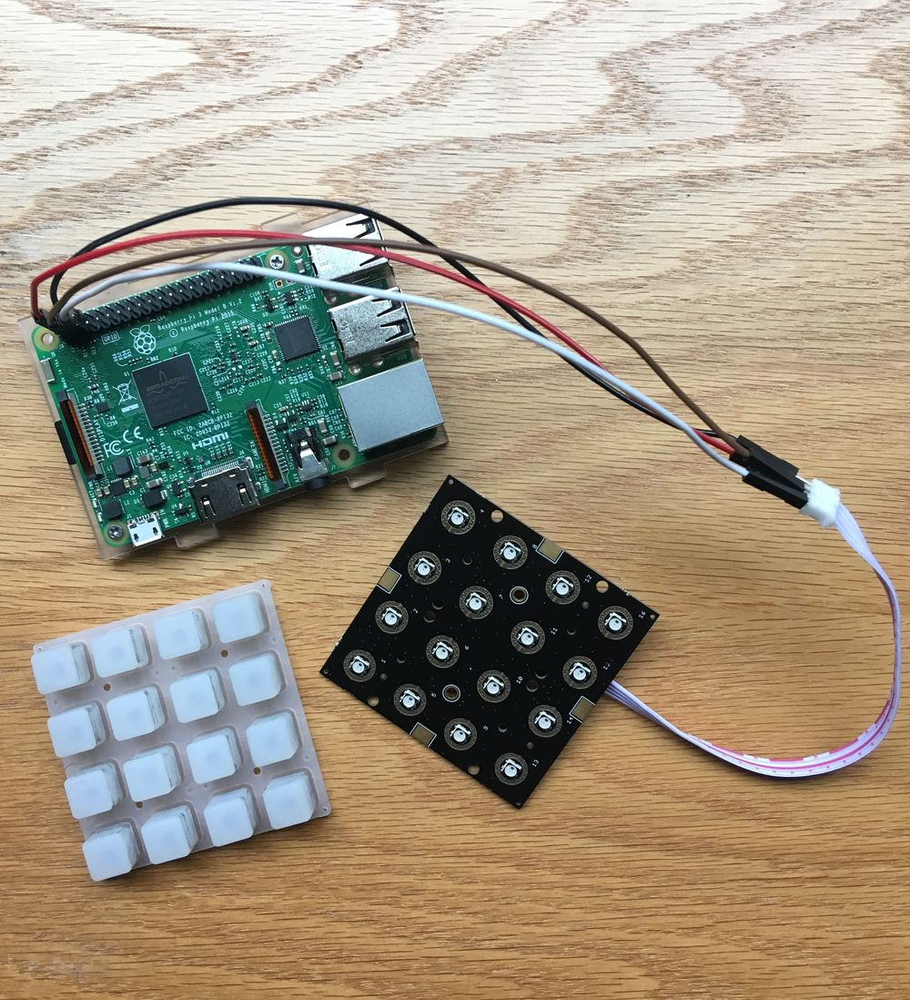

# loop-baby

a portable and affordable audio looper with quantization

how it works:
- audio input/output via a usb audio adapter
- midi clock signal via a midi-usb cable
- raspberry pi (with Raspbian) routes audio through [sooperlooper](http://essej.net/sooperlooper/)
- buttons interface with sooperlooper (via `looper.py`) to control recording/playback/saving/loading/etc.

## demo

https://github.com/mobeets/loop-baby/assets/1677179/cba4f8eb-7a24-425d-93a7-ca97e52e5eff

## requirements

hardware:

- raspberry pi (3B) with USB audio interface
- [neotrellis pcb](https://www.adafruit.com/product/3954) and [silicone buttons](https://www.adafruit.com/product/1611) for controlling the looper
- laser-cut enclosure (`static/photos/design.ai`)
- full [parts list](https://github.com/mobeets/loop-baby/wiki/Parts-list) with costs

software:

- python 3 with various packages (listed in `requirements.txt`)
- [jackd](https://jackaudio.org/): for routing audio
- [sooperlooper](http://essej.net/sooperlooper/): for looping

## running

`python3 looper.py -v -s`

the loops will be time quantized if you provide a clock signal via a midi-usb cable
